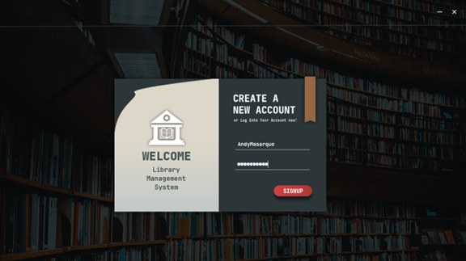
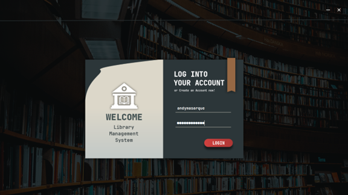
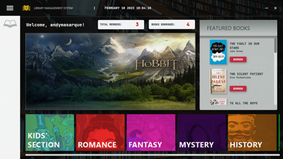
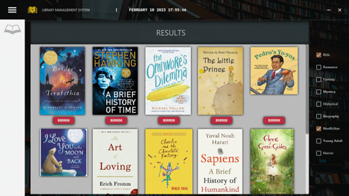
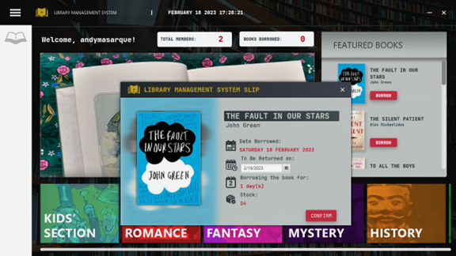
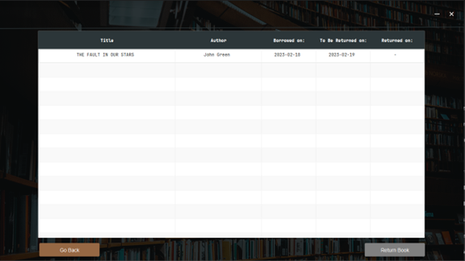
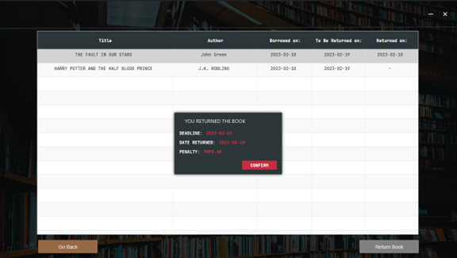

<h1 align='center'><b>Library Management System</b></h1>
<h3 align='center'><b>A Desktop Application Project for the course COMP 20083 - Object Oriented Programming from Polytechnic University of the Philippines.</b></h3>

### Overview

A __Library Management System__ is software specifically made to manage every part of a library. It helps librarians in maintaining a database of newly released books and also books that members have borrowed as well as their due dates. It is also used to maintain library records. It tracks the records of the number of books in the library, how many books are issued, how many books have been returned or renewed or late fine charges, etc.

### Tools

This project was made using __Java__ as the main programming language, __CSS__ to establish the design, and __JavaFX__ as the platform to create a desktop application.

### User Interface

#### Create Account

#### Login

#### Main Screen

#### Filter by Categories

#### Borrow a Book

#### Show Borrowed Books

#### Return a Book

### Disclaimer

This repository only serves as a container for the web application's source code. This is not intended for a local machine deployment or execution.

### Contributors

This project was made by John Kenneth Velano, Carlance Almeda, Andy Masarque, and John Russelle Malabanan.